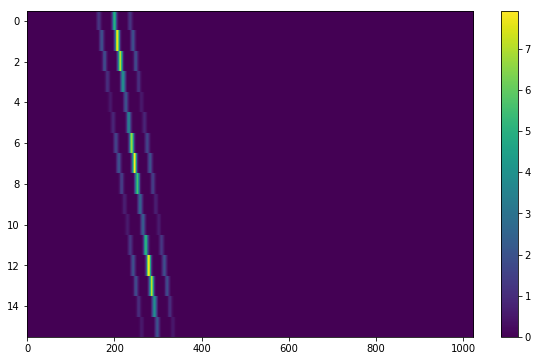

# setigen
Python library for generating and injecting artificial narrow-band signals into time-frequency data, as well as tools for working with filterbank data.

## Tools
The library contains tools that handle time-frequency data stored in NumPy arrays, as well as converting to and from filterbank files.

## Layout

Injecting an artificial signal is as simple as adding it to the data. To fully describe an artificial signal, we need the following:

* Start and stop times (in most cases, this would probably be the beginning and end of the observation, assuming the signal is "on" continuously)
* Frequency center of signal as a function of time sample
* Intensity modulation of signal as a function of time sample
* Frequency structure within each time sample
* Overall intensity modulation as a function of frequency (bandpass)

`setigen` provides sample functions and shapes for each of these parameters. These all contribute to the final structure of the signal - the goal is to empower the user to generate artificial signals that are as simple or complex as one would like.
