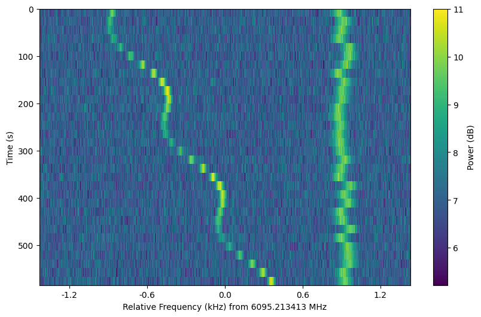

# setigen [](https://badge.fury.io/py/setigen) [](https://travis-ci.org/bbrzycki/setigen) [](https://setigen.readthedocs.io/en/latest/?badge=latest)

Python library for generating and injecting artificial narrow-band signals into time-frequency data, as well as tools for working with filterbank data.

<p align="center">

</p>

## Guiding Principles

Injecting an artificial signal is as simple as adding it to the data. To fully describe an artificial signal, we need the following:

* Start and stop times (in most cases, this would probably be the beginning and end of the observation, assuming the signal is "on" continuously)
* Frequency center of signal as a function of time sample
* Intensity modulation of signal as a function of time sample
* Frequency structure within each time sample
* Overall intensity modulation as a function of frequency (bandpass)

`setigen` provides sample functions and shapes for each of these parameters. These all contribute to the final structure of the signal - the goal is to empower the user to generate artificial signals that are as simple or complex as one would like.

## Minimal Working Example

Here's an example of synthetic signal generation, using `astropy.units` to express frame parameters:

```
from astropy import units as u
import setigen as stg
import matplotlib.pyplot as plt

frame = stg.Frame(fchans=1024*u.pixel,
                  tchans=32*u.pixel,
                  df=2.7939677238464355*u.Hz,
                  dt=18.25361108*u.s,
                  fch1=6095.214842353016*u.MHz)
noise = frame.add_noise(x_mean=10, noise_type='chi2')
signal = frame.add_signal(stg.constant_path(f_start=frame.get_frequency(index=200),
                                            drift_rate=2*u.Hz/u.s),
                          stg.constant_t_profile(level=frame.get_intensity(snr=30)),
                          stg.gaussian_f_profile(width=40*u.Hz),
                          stg.constant_bp_profile(level=1))

fig = plt.figure(figsize=(10, 6))
frame.render()
plt.savefig('example.png', bbox_inches='tight')
plt.show()
```

This first adds chi-squared noise to the frame, and adds a constant intensity signal at 30 SNR (relative to the background noise). The result is:

<p align="center">

</p>

Another example, using values found in real observations and visualized in the style of `blimpy`:

```
from astropy import units as u
import setigen as stg
import matplotlib.pyplot as plt

frame = stg.Frame(fchans=1024*u.pixel,
                  tchans=16*u.pixel,
                  df=2.7939677238464355*u.Hz,
                  dt=18.25361108*u.s,
                  fch1=6095.214842353016*u.MHz)
noise = frame.add_noise_from_obs()
signal = frame.add_signal(stg.constant_path(f_start=frame.get_frequency(index=200),
                                            drift_rate=2*u.Hz/u.s),
                          stg.constant_t_profile(level=frame.get_intensity(snr=30)),
                          stg.gaussian_f_profile(width=40*u.Hz),
                          stg.constant_bp_profile(level=1))

fig = plt.figure(figsize=(10, 6))
frame.bl_render()
plt.show()
```

<p align="center">

</p>
