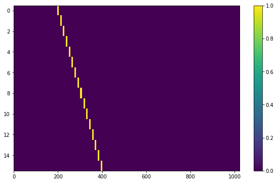

Generating a basic signal
---------------------

The main method that generates signals is :func:`setigen.generate_signal.generate`.
We need to pass in an array of times, frequencies, and functions that describe
the shape of the signal over time, over frequency within individual time samples,
and over a bandpass of frequencies. :mod:`setigen` comes prepackaged with common
functions (:mod:`setigen.funcs`), but you can write your own!

The most basic signal that you can generate is a constant-intensity, constant
drift-rate signal.

.. code-block:: python

    import setigen as stg
    import numpy as np

    # Define time and frequency arrays, essentially labels for the 2D data array
    tsamp = 18.25361108
    fch1 = 6095.214842353016
    df = -2.7939677238464355e-06
    fchans = 1024
    tchans = 16
    fs = np.arange(fch1, fch1 + fchans * df, df)
    ts = np.arange(0, tchans * tsamp, tsamp)

    # Generate the signal
    signal = stg.generate(ts,
                          fs,
                          stg.constant_path(f_start = fs[200], drift_rate = -0.000002),
                          stg.constant_t_profile(level = 1),
                          stg.box_f_profile(width = 0.00001),
                          stg.constant_bp_profile(level = 1))

:code:`signal` is a 2D NumPy array with the resulting time-frequency data. To
visualize this, we use :func:`matplotlib.pyplot.imshow`::

    import matplotlib.pyplot as plt
    fig = plt.figure(figsize=(10,6))
    plt.imshow(signal, aspect='auto')
    plt.colorbar()
    fig.savefig("basic_signal.png", bbox_inches='tight')

