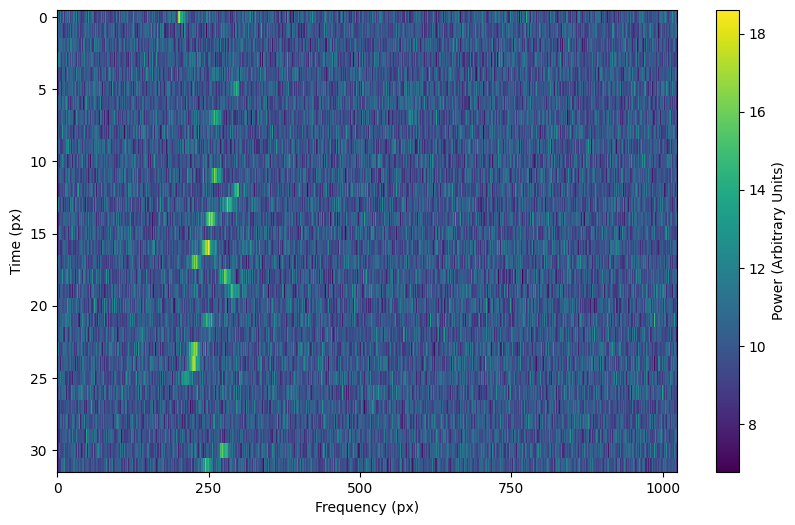
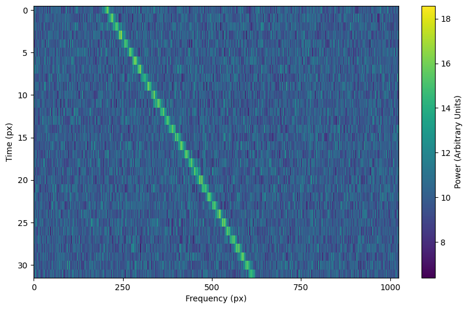

.. |setigen| replace:: :mod:`setigen`
.. _setigen.funcs: https://setigen.readthedocs.io/en/master/setigen.funcs.html

Advanced topics
===============

Advanced signal creation
------------------------

Behind the scenes, :func:`~setigen.frame.Frame.add_signal` uses signal parameter
functions to compute intensity for each time, frequency pair in the data. This
is kept quite general to allow for the creation of complex signals. In this
section, we explore some of the flexibility behind :func:`~setigen.frame.Frame.add_signal`.

Writing custom signal functions
^^^^^^^^^^^^^^^^^^^^^^^^^^^^^^^

You can go beyond :mod:`setigen`'s pre-written signal functions by
writing your own. For each :func:`~setigen.frame.Frame.add_signal` input parameter
(:code:`path`, :code:`t_profile`, :code:`f_profile`, and :code:`bp_profile`),
you can pass in your own custom functions. Note that these inputs are themselves functions.

It's important that the functions you pass into each parameter have the correct
inputs and outputs. Specifically:

    :code:`path`
        Function that takes in time [array] ``t`` and outputs a frequency [array]

    :code:`t_profile`
        Function that takes in time [array] ``t`` and outputs an intensity [array]

    :code:`f_profile`
        Function that takes in frequency [array] ``f`` and a reference central
        frequency [array] ``f_center``, and outputs an intensity [array]

    :code:`bp_profile`
        Function that takes in frequency [array] ``f`` and outputs an intensity [array]

For example, here's the code behind the sine path shape:

.. code-block:: Python

    def my_sine_path(f_start, drift_rate, period, amplitude):
        def path(t):
            return f_start + amplitude * np.sin(2 * np.pi * t / period) + drift_rate * t
        return path

Alternately, you can use the lambda operator:

.. code-block:: Python

    def my_sine_path(f_start, drift_rate, period, amplitude):
        return lambda t: return f_start + amplitude * np.sin(2 * np.pi * t / period) + drift_rate * t

These can then be incorporated as:

.. code-block:: Python

    signal = frame.add_signal(my_sine_path(f_start=frame.get_frequency(200),
                                           drift_rate=2*u.Hz/u.s,
                                           period=100*u.s,
                                           amplitude=100*u.Hz),
                              stg.constant_t_profile(level=1),
                              stg.box_f_profile(width=20*u.Hz),
                              stg.constant_bp_profile(level=1))

To see more examples on how you might write your own parameter functions, check out the
source code behind the pre-written functions (setigen.funcs_).

Using arrays as signal parameters
^^^^^^^^^^^^^^^^^^^^^^^^^^^^^^^^^

Sometimes it can be difficult to wrap up a desired signal property into a
separate function, or perhaps there is external existing code that calculates
desired properties. In these cases, we can also use arrays to describe these signals,
instead of functions.

.. code-block:: python

    from astropy import units as u
    import numpy as np
    import setigen as stg
    import matplotlib.pyplot as plt

    frame = stg.Frame(fchans=1024*u.pixel,
                      tchans=32*u.pixel,
                      df=2.7939677238464355*u.Hz,
                      dt=18.25361108*u.s,
                      fch1=6095.214842353016*u.MHz)
    frame.add_noise(x_mean=5, x_std=2, x_min=0)

    path_array = np.random.rand(frame.get_frequency(200),
                                frame.get_frequency(400),
                                32)
    t_profile_array = np.random.rand(frame.get_intensity(snr=20),
                                     frame.get_intensity(snr=40),
                                     32)

    frame.add_signal(path_array,
                     t_profile_array,
                     stg.gaussian_f_profile(width=40*u.Hz),
                     stg.constant_bp_profile(level=1))

    fig = plt.figure(figsize=(10, 6))
    frame.render()
    plt.savefig('frame.png', bbox_inches='tight')
    plt.show()

.. image:: images/advanced_array_synth.png

Optimization and accuracy
^^^^^^^^^^^^^^^^^^^^^^^^^

By default, :code:`add_signal` calculates an intensity value for every
time, frequency pairing. Depending on the situation, this might not be the best behavior.

For example, if you are injecting synthetic narrowband signals into a very large
frame of data, it can be inefficient and unnecessary to calculate intensity values
for every pixel in the frame. In other cases, perhaps calculating intensity values
at only every (dt, df) offset would be too inaccurate.

Optimization
~~~~~~~~~~~~

To limit the range of signal computation, you can use the :code:`bounding_f_range`
parameter of :code:`add_signal`. This takes in a tuple of frequencies
:code:`(bounding_min, bounding_max)`, between which the signal will be computed.

.. code-block:: Python

    signal = frame.add_signal(stg.constant_path(f_start=frame.get_frequency(200),
                                                drift_rate=2*u.Hz/u.s),
                              stg.constant_t_profile(level=1),
                              stg.box_f_profile(width=20*u.Hz),
                              stg.constant_bp_profile(level=1),
                              bounding_f_range=(frame.get_frequency(100),
                                                frame.get_frequency(700)))

As an example of how this can reduce needless computation, we can time different
frame manipulations for a large frame:

.. code-block:: Python

    import time

    times = []
    times.append(time.time())

    frame = stg.Frame(fchans=2**20,
                      tchans=32,
                      df=2.7939677238464355*u.Hz,
                      dt=18.25361108*u.s,
                      fch1=6095.214842353016*u.MHz)
    times.append(time.time())

    frame.add_noise(x_mean=5, x_std=2, x_min=0)
    times.append(time.time())

    # Normal add_signal
    frame.add_signal(stg.constant_path(f_start=frame.get_frequency(200),
                                       drift_rate=2*u.Hz/u.s),
                     stg.constant_t_profile(level=frame.get_intensity(snr=30)),
                     stg.gaussian_f_profile(width=40*u.Hz),
                     stg.constant_bp_profile(level=1))
    times.append(time.time())

    # Limiting computation with bounding_f_range
    frame.add_signal(stg.constant_path(f_start=frame.get_frequency(200),
                                       drift_rate=2*u.Hz/u.s),
                     stg.constant_t_profile(level=frame.get_intensity(snr=30)),
                     stg.gaussian_f_profile(width=40*u.Hz),
                     stg.constant_bp_profile(level=1),
                     bounding_f_range=(frame.get_frequency(100),
                                       frame.get_frequency(700)))
    times.append(time.time())

    x = np.array(times)
    print(x[1:] - x[:-1])

    >>> [1.14681625 1.4038794  1.6308465  0.02862048]

Depending on the type of signal, you should be cautious when defining a bounding
frequency range. For signals with constant drift rate and small spectral width,
it isn't too hard to define a range. For example, :code:`frame.add_constant_signal`
uses bounding ranges automatically to optimize signal creation.

However, for signals
with large or stochastic frequency variation, or with long spectral tails, it
can be difficult to define a bounding range without cutting off parts of these signals.

To illustrate this, using the above example that takes arrays as signal parameters,
setting too small of a bounding frequency range can look like:

.. code-block:: Python

    frame = stg.Frame(fchans=1024*u.pixel,
                      tchans=32*u.pixel,
                      df=2.7939677238464355*u.Hz,
                      dt=18.25361108*u.s,
                      fch1=6095.214842353016*u.MHz)
    frame.add_noise(x_mean=5, x_std=2, x_min=0)

    path_array = np.random.uniform(frame.get_frequency(200),
                                   frame.get_frequency(400),
                                   32)
    t_profile_array = np.random.uniform(frame.get_intensity(snr=20),
                                        frame.get_intensity(snr=40),
                                        32)

    frame.add_signal(path_array,
                     t_profile_array,
                     stg.gaussian_f_profile(width=40*u.Hz),
                     stg.constant_bp_profile(level=1),
                     bounding_f_range=(frame.get_frequency(200),
                                       frame.get_frequency(300)))

Accuracy
~~~~~~~~

To improve accuracy a bit, we can integrate signal computations over subsamples in
time and frequency. The function :code:`add_signal` has three boolean parameters:
:code:`integrate_path`, :code:`integrate_t_profile`, and :code:`integrate_f_profile`,
which control whether various integrations are turned on (by default, they are False).
The former two depend on the :code:`t_subsamples` parameter, which is the number
of bins per time sample (e.g. per dt) over which to integrate; likewise, :code:`integrate_f_profile`
depends on the :code:`f_subsamples` parameter.

:code:`integrate_path` controls integration of the signal's center frequency with
respect to time, :code:`path`. If your :code:`path` varies on timescales shorter than
the time resolution dt, then it could make sense to integrate to get more
appropriate frequency positions.

:code:`integrate_t_profile` controls integration of the intensity variation with respect to
time, :code:`t_profile`. If your :code:`t_profile` varies on timescales shorter than the
time resolution dt, then it could make sense to integrate to get more
appropriate intensities.

:code:`integrate_f_profile` controls integration of the intensity variation with respect to
frequency, :code:`f_profile`. If your :code:`f_profile` varies on spectral scales
shorter than the frequency resolution df, then it could make sense to integrate
to get more appropriate intensities.

Note that since integration requires make multiple calculations per pixel, it
can increase signal computation time significantly. Be sure to evaluate whether
it's actually necessary to integrate, or whether the default add_signal computation
is sufficient for your use cases.

Here is an example of integration in action:

.. code-block:: Python

    frame = stg.Frame(fchans=1024*u.pixel,
                      tchans=32*u.pixel,
                      df=2.7939677238464355*u.Hz,
                      dt=18.25361108*u.s,
                      fch1=6095.214842353016*u.MHz)
    frame.add_noise(x_mean=5, x_std=2, x_min=0)

    frame.add_signal(stg.constant_path(f_start=frame.get_frequency(200),
                                       drift_rate=2*u.Hz/u.s),
                     stg.constant_t_profile(level=frame.get_intensity(snr=30)),
                     stg.gaussian_f_profile(width=40*u.Hz),
                     stg.constant_bp_profile(level=1),
                     integrate_path=True,
                     integrate_t_profile=True,
                     integrate_f_profile=True,
                     t_subsamples=10,
                     f_subsamples=10)

Creating custom observational noise distributions
--------------------------------------------------------

Create a dataset using existing observations
----------------------------------------------------
