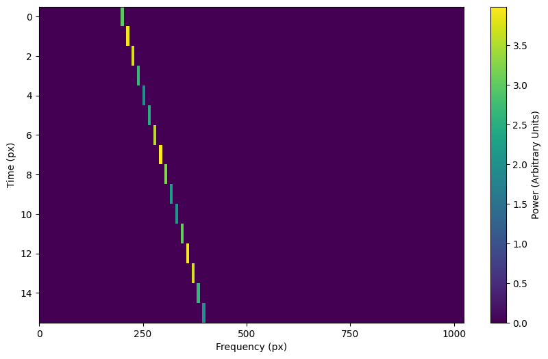
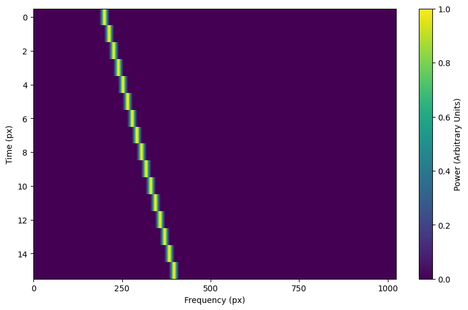
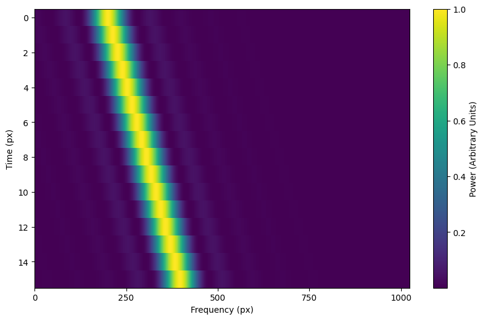
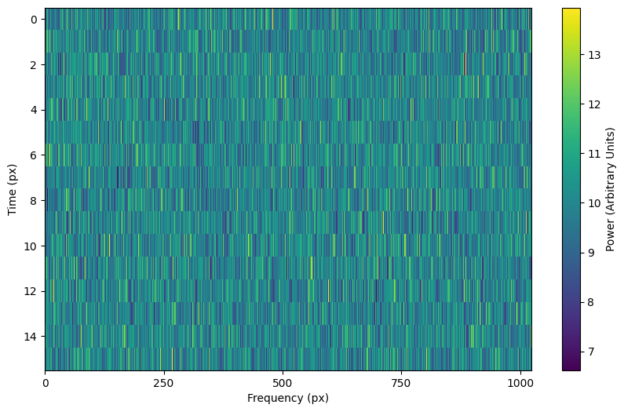
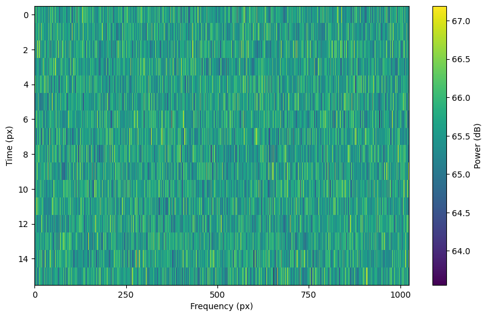

.. |setigen| replace:: :mod:`setigen`
.. _setigen.funcs: https://setigen.readthedocs.io/en/main/setigen.funcs.html
.. _`Getting started`: https://setigen.readthedocs.io/en/main/getting_started.html
.. _`Advanced`: https://setigen.readthedocs.io/en/main/advanced.html
.. _`observational data`: https://setigen.readthedocs.io/en/main/advanced.html#creating-custom-observational-noise-distributions

Basic usage (setigen.Frame)
===========================

Creating a frame
----------------

There are multiple ways to create a Frame object, depending on what information 
you're starting with. 

For an empty frame with known parameters, you may use standard instantiation. In this case,
you need to provide frame dimensions, time and frequency resolutions, starting frequency
(``fch1``), and whether frequencies should be considered increasing or decreasing
when writing to file. Note that within a Frame object, signal calculations are done with
increasing frequencies regardless of this parameter.

.. code-block:: Python

    from astropy import units as u
    import setigen as stg
    
    frame = stg.Frame(fchans=1024,
                      tchans=16,
                      df=2.7939677238464355*u.Hz,
                      dt=18.253611008*u.s,
                      fch1=6095.214842353016*u.MHz,
                      ascending=False)
                      
If you have a 2D Numpy array of spectrogram data, you may alternatively use 
:func:`setigen.frame.Frame.from_data`:

.. code-block:: Python
    
    import numpy as np
    
    rng = np.random.default_rng()
    data = rng.normal(size=(16, 1024))
    frame = stg.Frame.from_data(df=2.7939677238464355*u.Hz,
                                dt=18.253611008*u.s,
                                fch1=6095.214842353016*u.MHz,
                                ascending=False,
                                data)
                      
If you know the parameters behind the data generation, and not necessarily the 
actual frame resolution, you may use :func:`setigen.frame.Frame.from_backend_params`:

.. code-block:: Python

    frame = stg.Frame.from_backend_params(fchans=1024,
                                          obs_length=300,
                                          sample_rate=3e9,
                                          num_branches=1024,
                                          fftlength=1048576,
                                          int_factor=51,
                                          fch1=6*u.GHz,
                                          ascending=False,
                                          data=None)
                                          
where ``obs_length`` is the integration period, ``sample_rate`` is the 
sampling rate in Hz, code:`num_branches` is the branches in the polyphase 
filterbank, code:`fftlength` is the number of fine channels per coarse channel, 
and ``int_factor`` is the integration factor used in data reduction. Note 
that ``int_factor`` is set to determine the number of time bins in the 
frame. You may also set the ``data`` parameter to include existing 2D data, 
from which ``fchans`` will be automatically inferred. Since multiple 
``int_factor`` values may correspond to the same number of time bins, for 
clarity we do not also infer ``int_factor`` just from the dimensions of the 
data.

Finally, you can construct a frame directly from a ``.fil``/``.h5`` file or Waterfall object:

.. code-block:: Python
    
    wf_path = 'path/to/data.fil'
    wf = bl.Waterfall(wf_path)
    frame_wf = stg.Frame(waterfall=wf)
    frame_path = stg.Frame(waterfall=wf_path)
    
Alternately:

.. code-block:: Python
    
    frame_wf = stg.Frame.from_waterfall(wf)
    frame_path = stg.Frame.from_waterfall(wf_path)
    
    
Adding a basic signal
-------------------------

The main method that generates signals is :func:`~setigen.frame.Frame.add_signal`.
This allows us to pass in an functions or arrays that describe
the shape of the signal over time, over frequency within individual time samples,
and over a bandpass of frequencies. :mod:`setigen` comes prepackaged with common
functions (setigen.funcs_), but you can write your own!

The most basic signal that you can generate is a constant intensity, constant
drift-rate signal. Note that as in the `Getting started`_ example, you can also use
:func:`~setigen.Frame.add_constant_signal`, which is simpler and more efficient for
signal injection into large data frames.

.. code-block:: Python

    from astropy import units as u
    import numpy as np
    import setigen as stg

    # Define time and frequency arrays, essentially labels for the 2D data array
    fchans = 1024
    tchans = 16
    df = 2.7939677238464355*u.Hz
    dt = 18.253611008*u.s
    fch1 = 6095.214842353016*u.MHz

    frame = stg.Frame(fchans=fchans,
                      tchans=tchans,
                      df=df,
                      dt=dt,
                      fch1=fch1)
    signal = frame.add_signal(stg.constant_path(f_start=frame.get_frequency(200),
                                                drift_rate=2*u.Hz/u.s),
                              stg.constant_t_profile(level=1),
                              stg.box_f_profile(width=20*u.Hz),
                              stg.constant_bp_profile(level=1))

:func:`~setigen.frame.Frame.add_signal` returns a 2D numpy array containing only the 
synthetic signal. To visualize the resulting frame, we can use 
:func:`~setigen.frame.Frame.plot`:

.. code-block:: Python

    import matplotlib.pyplot as plt
    fig = plt.figure(figsize=(10, 6))
    frame.plot("px", db=False)
    fig.savefig("basic_signal.png", bbox_inches='tight')

.. image:: images/basic_signal.png

In |setigen|, we use ``astropy.units`` to exactly specify where signals
should be in time-frequency space. Astropy automatically handles unit conversions
(MHz -> Hz, etc.), which is a nice convenience. Nevertheless, you can also use normal
SI units (Hz, s) without additional modifiers, in which case the above code would become:

.. code-block:: Python

    from astropy import units as u
    import numpy as np
    import setigen as stg

    # Define time and frequency arrays, essentially labels for the 2D data array
    fchans = 1024
    tchans = 16
    df = 2.7939677238464355
    dt = 18.253611008
    fch1 = 6095.214842353016 * 10**6

    frame = stg.Frame(fchans=fchans,
                      tchans=tchans,
                      df=df,
                      dt=dt,
                      fch1=fch1)
    signal = frame.add_signal(stg.constant_path(f_start=frame.get_frequency(200),
                                                drift_rate=2),
                              stg.constant_t_profile(level=1),
                              stg.box_f_profile(width=20),
                              stg.constant_bp_profile(level=1))

So, it isn't quite necessary to use ``astropy.units``, but it's an option
to avoid manual unit conversion and calculation.

Using prepackaged signal functions
----------------------------------

With :mod:`setigen`'s pre-written signal functions, you can generate a variety
of signals right off the bat. The main signal parameters that customize the
synthetic signal are ``path``, ``t_profile``, ``f_profile``, and
``bp_profile``.

``path`` describes the path of the signal in time-frequency space. The
``path`` function takes in a time and outputs 'central' frequency
corresponding to that time.

``t_profile`` (time profile) describes the intensity of the signal over
time. The ``t_profile`` function takes in a time and outputs an intensity.

``f_profile`` (frequency profile) describes the intensity of the signal
within a time sample as a function of relative frequency. The ``f_profile``
function takes in a frequency and a central frequency and computes an intensity.
This function is used to control the spectral shape of the signal (with respect
to a central frequency), which may be a square wave, a Gaussian, or any custom
shape!

``bp_profile`` describes the intensity of the signal over the bandpass of
frequencies. Whereas ``f_profile`` computes intensity with respect to a
relative frequency, ``bp_profile`` computes intensity with respect to the
absolute frequency value. The ``bp_profile`` function takes in a frequency
and outputs an intensity as well.

All these functions combine to form the final synthetic signal, which means
you can create a host of signals by switching up these parameters!

Here are just a few examples of pre-written signal functions. To see all of the included functions, check out setigen.funcs_. To avoid needless
repetition, each example script will assume the same basic setup:

.. code-block:: Python

    from astropy import units as u
    import numpy as np
    import setigen as stg

    # Define time and frequency arrays, essentially labels for the 2D data array
    fchans = 1024
    tchans = 16
    df = 2.7939677238464355*u.Hz
    dt = 18.253611008*u.s
    fch1 = 6095.214842353016*u.MHz

    frame = stg.Frame(fchans=fchans,
                      tchans=tchans,
                      df=df,
                      dt=dt,
                      fch1=fch1)

``paths`` - trajectories in time-frequency space
^^^^^^^^^^^^^^^^^^^^^^^^^^^^^^^^^^^^^^^^^^^^^^^^

Constant path
~~~~~~~~~~~~~

A constant path is a linear Doppler-drifted signal. To generate this path, use
:func:`~setigen.funcs.paths.constant_path` and specify the starting frequency of
the signal and the drift rate (in units of frequency over time, consistent with
the units of your time and frequency arrays):

.. code-block:: Python

    signal = frame.add_signal(stg.constant_path(f_start=frame.get_frequency(200),
                                                drift_rate=2*u.Hz/u.s),
                              stg.constant_t_profile(level=1),
                              stg.box_f_profile(width=20*u.Hz),
                              stg.constant_bp_profile(level=1))

.. image:: images/basic_signal.png

Sine path
~~~~~~~~~

This path is a sine wave, controlled by a starting frequency, drift rate, period,
and amplitude, using :func:`~setigen.funcs.paths.sine_path`.

.. code-block:: Python

    signal = frame.add_signal(stg.sine_path(f_start=frame.get_frequency(200),
                                            drift_rate=2*u.Hz/u.s,
                                            period=100*u.s,
                                            amplitude=100*u.Hz),
                              stg.constant_t_profile(level=1),
                              stg.box_f_profile(width=20*u.Hz),
                              stg.constant_bp_profile(level=1))

Squared path
~~~~~~~~~~~~

This path is a very simple quadratic with respect to time, using
:func:`~setigen.funcs.paths.squared_path`.

.. code-block:: Python

    signal = frame.add_signal(stg.squared_path(f_start=frame.get_frequency(200),
                                               drift_rate=0.01*u.Hz/u.s),
                              stg.constant_t_profile(level=1),
                              stg.box_f_profile(width=20*u.Hz),
                              stg.constant_bp_profile(level=1))

RFI-like path
~~~~~~~~~~~~~

This path randomly varies in frequency, as in some RFI signals, using
:func:`~setigen.funcs.paths.simple_rfi_path`. The following example shows two
such signals, with ``rfi_type`` set to 'stationary' and 'random_walk'. You 
can define ``drift_rate`` to set these signals in relation to a straight
line path.

.. code-block:: Python

    frame.add_signal(stg.simple_rfi_path(f_start=frame.fs[200], 
                                         drift_rate=0*u.Hz/u.s,
                                         spread=300*u.Hz,
                                         spread_type='uniform',
                                         rfi_type='stationary'),
                     stg.constant_t_profile(level=1),
                     stg.box_f_profile(width=20*u.Hz),
                     stg.constant_bp_profile(level=1))

    frame.add_signal(stg.simple_rfi_path(f_start=frame.fs[600], 
                                         drift_rate=0*u.Hz/u.s,
                                         spread=300*u.Hz,
                                         spread_type='uniform',
                                         rfi_type='random_walk'),
                     stg.constant_t_profile(level=1),
                     stg.box_f_profile(width=20*u.Hz),
                     stg.constant_bp_profile(level=1))

``t_profiles`` - intensity variation with time
^^^^^^^^^^^^^^^^^^^^^^^^^^^^^^^^^^^^^^^^^^^^^^

Constant intensity
~~~~~~~~~~~~~~~~~~

To generate a signal with the same intensity over time, use
:func:`~setigen.funcs.t_profiles.constant_t_profile`, specifying only the
intensity level:

.. code-block:: Python

    signal = frame.add_signal(stg.constant_path(f_start=frame.get_frequency(200),
                                            drift_rate=2*u.Hz/u.s),
                          stg.constant_t_profile(level=1),
                          stg.box_f_profile(width=20*u.Hz),
                          stg.constant_bp_profile(level=1))

.. image:: images/basic_signal.png

Sine intensity
~~~~~~~~~~~~~~

To generate a signal with sinusoidal intensity over time, use
:func:`~setigen.funcs.t_profiles.sine_t_profile`, specifying the period,
amplitude, and average intensity level. The intensity level is essentially an
offset added to a sine function, so it should be equal or greater than the
amplitude so that the signal doesn't have any negative values.

Here's an example with equal level and amplitude:

.. code-block:: Python

    signal = frame.add_signal(stg.constant_path(f_start=frame.get_frequency(200),
                                                drift_rate=2*u.Hz/u.s),
                              stg.sine_t_profile(period=100*u.s,
                                                 amplitude=1,
                                                 level=1),
                              stg.box_f_profile(width=20*u.Hz),
                              stg.constant_bp_profile(level=1))

.. image:: images/sine_intensity_1_1.png

And here's an example with the level a bit higher than the amplitude:

.. code-block:: Python

    signal = frame.add_signal(stg.constant_path(f_start=frame.get_frequency(200),
                                                drift_rate=2*u.Hz/u.s),
                              stg.sine_t_profile(period=100*u.s,
                                                 amplitude=1,
                                                 level=3),
                              stg.box_f_profile(width=20*u.Hz),
                              stg.constant_bp_profile(level=1))

``f_profiles`` - intensity variation with time
^^^^^^^^^^^^^^^^^^^^^^^^^^^^^^^^^^^^^^^^^^^^^^

Box / square intensity profile
~~~~~~~~~~~~~~~~~~~~~~~~~~~~~~

To generate a signal with the same intensity over frequency, use
:func:`~setigen.funcs.f_profiles.box_f_profile`, specifying the width of the
signal:

.. code-block:: Python

    signal = frame.add_signal(stg.constant_path(f_start=frame.get_frequency(200),
                                                drift_rate=2*u.Hz/u.s),
                              stg.constant_t_profile(level=1),
                              stg.box_f_profile(width=40*u.Hz),
                              stg.constant_bp_profile(level=1))

.. image:: images/box_profile.png

Sinc squared intensity profile
~~~~~~~~~~~~~~~~~~~~~~~~~~~~~~

To generate a signal with a sinc squared intensity profile in the frequency direction, use
:func:`~setigen.funcs.f_profiles.sinc2_f_profile`, specifying the width of the
signal:

.. code-block:: Python

    signal = frame.add_signal(stg.constant_path(f_start=frame.get_frequency(200),
                                                drift_rate=2*u.Hz/u.s),
                              stg.constant_t_profile(level=1),
                              stg.sinc2_f_profile(width=40*u.Hz),
                              stg.constant_bp_profile(level=1))

By default, the function has the parameter ``trunc=True`` to truncate the 
sinc squared function at the first zero-crossing. With ``trunc=False`` 
and using a larger width to show the effect:

.. code-block:: Python

    signal = frame.add_signal(stg.constant_path(f_start=frame.get_frequency(200),
                                                drift_rate=2*u.Hz/u.s),
                              stg.constant_t_profile(level=1),
                              stg.sinc2_f_profile(width=200*u.Hz, trunc=False),
                              stg.constant_bp_profile(level=1))

Note that you can model the frequency response of a perfect cosine signal with:

.. code-block:: Python

    stg.sinc2_f_profile(width=2*frame.df, 
                        width_mode="crossing",
                        trunc=False)

Gaussian intensity profile
~~~~~~~~~~~~~~~~~~~~~~~~~~

To generate a signal with a Gaussian intensity profile in the frequency
direction, use :func:`~setigen.funcs.f_profiles.gaussian_f_profile`, specifying
the width of the signal:

.. code-block:: Python

    signal = frame.add_signal(stg.constant_path(f_start=frame.get_frequency(200),
                                                drift_rate=2*u.Hz/u.s),
                              stg.constant_t_profile(level=1),
                              stg.gaussian_f_profile(width=40*u.Hz),
                              stg.constant_bp_profile(level=1))

.. image:: images/gaussian_profile.png

Multiple Gaussian intensity profile
~~~~~~~~~~~~~~~~~~~~~~~~~~~~~~~~~~~

The profile :func:`~setigen.funcs.f_profiles.multiple_gaussian_f_profile`,
generates a symmetric signal with three Gaussians; one main signal and two
smaller signals on either side. This is mostly a demonstration that 
``f_profile`` functions can be composite, and you can create custom 
functions like this (`Advanced`_).

.. code-block:: Python

    signal = frame.add_signal(stg.constant_path(f_start=frame.get_frequency(200),
                                                drift_rate=2*u.Hz/u.s),
                              stg.constant_t_profile(level=1),
                              stg.multiple_gaussian_f_profile(width=40*u.Hz),
                              stg.constant_bp_profile(level=1))

.. image:: images/multiple_gaussian_profile.png

Adding synthetic noise
----------------------

The background noise in high resolution BL data inherently follows a chi-squared 
distribution. Depending on the data's spectral and temporal resolutions, with enough 
integration blocks, the noise approaches a Gaussian distribution. :mod:`setigen` 
supports both distributions for noise generation, but uses chi-squared by default.

Every time synthetic noise is added to an image, :mod:`setigen` will
estimate the noise properties of the frame, and you can get these via
:func:`~setigen.Frame.get_total_stats` and :func:`~setigen.Frame.get_noise_stats`.

Important note: over a range of many frequency channels, real radio data has
complex systematic structure, such as coarse channels and bandpass shapes.
Adding synthetic noise according to a pure statistical distribution
as the background for your frames is therefore most appropriate when your 
frame size is somewhat limited in frequency, in which case you can mostly ignore 
these systematic artifacts. As usual, whether this is something you should care about 
just depends on your use cases.

Adding pure chi-squared noise
^^^^^^^^^^^^^^^^^^^^^^^^^^^^^^^^^^

A minimal working example for adding noise is:

.. code-block:: Python

    import matplotlib.pyplot as plt
    import numpy as np
    from astropy import units as u
    import setigen as stg

    # Define time and frequency arrays, essentially labels for the 2D data array
    fchans = 1024
    tchans = 16
    df = 2.7939677238464355*u.Hz
    dt = 18.253611008*u.s
    fch1 = 6095.214842353016*u.MHz

    frame = stg.Frame(fchans=fchans,
                      tchans=tchans,
                      df=df,
                      dt=dt,
                      fch1=fch1)
    noise = frame.add_noise(x_mean=10)

    fig = plt.figure(figsize=(10, 6))
    frame.plot("px", db=False)
    plt.show()

This adds chi-squared noise scaled to a mean of 10. :func:`~setigen.frame.Frame.add_noise` 
returns a 2D numpy array containing only the synthetic noise, and uses a default argument of
``noise_type=chi2``. Behind the scenes, the degrees of freedom used in the chi-squared 
distribution are calculated using the frame resolution and can be accessed via the 
``frame.chi2_df`` attribute.

Adding pure Gaussian noise
^^^^^^^^^^^^^^^^^^^^^^^^^^^^^^^^^^

An example for adding Gaussian noise is:

.. code-block:: Python

    frame = stg.Frame(fchans=fchans,
                      tchans=tchans,
                      df=df,
                      dt=dt,
                      fch1=fch1)
    noise = frame.add_noise(x_mean=5, x_std=2, noise_type='gaussian')

This adds Gaussian noise with mean 5 and standard deviation 2 to an empty frame.

Adding synthetic noise based on real observations
^^^^^^^^^^^^^^^^^^^^^^^^^^^^^^^^^^^^^^^^^^^^^^^^^^^^^^^^^^^^^^^^^^^^

We can also generate synthetic noise whose parameters are sampled from real
observations. Specifically, we can select the mean for chi-squared noise, or 
additionally the standard deviation and minimum for Gaussian noise, from 
distributions of parameters estimated from observations.

If no distributions are provided by the user, noise parameters are sampled by
default from pre-loaded distributions in :mod:`setigen`. These were estimated
from GBT C-Band observations on frames with (dt, df) = (1.4 s, 1.4 Hz) and
(tchans, fchans) = (32, 1024). Behind the scenes, the mean, standard deviation,
and minimum intensity over each sub-frame in the observation were saved into
three respective numpy arrays. 

The :func:`~setigen.Frame.add_noise_from_obs` function also uses chi-squared noise by default,
selecting a mean intensity from the sampled observational distribution of means, and
populating the frame with chi-squared noise accordingly. 

Alternately, by setting ``noise_type=gaussian`` or ``noise_type=normal`` 
the function will select a mean, standard deviation, and minimum from these arrays (not
necessarily all corresponding to the same original observational sub-frame), and
populates your frame with Gaussian noise. You can also set the
``share_index`` parameter to True, to force these random noise parameter selections
to all correspond to the same original observational sub-frame.

Note that these pre-loaded observations only
serve as approximations and real observations vary depending on the noise
temperature and frequency band. To be safe, you can generate your own parameters
distributions from `observational data`_.

For chi-squared noise:

.. code-block:: Python

    noise = frame.add_noise_from_obs()

We can readily see that the intensities are similar to a real GBT observation's.

For Gaussian noise:

.. code-block:: Python

    noise = frame.add_noise_from_obs(noise_type='gaussian')

We can also specify the distributions from which to sample parameters, one
each for the mean, standard deviation, and minimum, as below. Note: just as
in the pure noise generation above, you don't need to specify an x_min_array
from which to sample if there's no need to truncate the noise at a lower bound.

.. code-block:: Python

    noise = frame.add_noise_from_obs(x_mean_array=[3,4,5],
                                     x_std_array=[1,2,3],
                                     x_min_array=[1,2],
                                     share_index=False,
                                     noise_type='chi2')

For chi-squared noise, only ``x_mean_array`` is used. For Gaussian noise, by default,
random noise parameter selections are forced to use the same indices (as opposed 
to randomly choosing a parameter from each array) via ``share_index=True``.

Convenience functions for signal generation
-------------------------------------------

There are a few functions included in ``Frame`` that can help in constructing 
synthetic signals.

SNR <-> Intensity
^^^^^^^^^^^^^^^^^

If a frame has background noise, we can calculate intensities corresponding to
different signal-to-noise (SNR) values. Here, the SNR of a signal is obtained
from integrating over the entire time axis, e.g. so that it reduces noise by
``sqrt(tchans)``.

For example, the included signal parameter functions in |setigen| all calculate
signals based on absolute intensities, so if you'd like to include a signal with
an SNR of 10, you would do:

.. code-block:: Python

    intensity = frame.get_intensity(snr=10)

Alternately, you can get the SNR of a given intensity by doing:

.. code-block:: Python

    snr = frame.get_snr(intensity=100)

Frequency <-> Index
^^^^^^^^^^^^^^^^^^^

Another useful conversion is between frequencies and frame indices:

.. code-block:: Python

    index = frame.get_index(frequency)
    frequency = frame.get_frequency(index)

Drift rate
^^^^^^^^^^

For some injection tasks, you might want to define signals based on where they
start and end on the frequency axis. Furthermore, this might not depend on
frequency per se. In these cases, you can calculate a drift frequency using the
:func:`~setigen.Frame.get_drift_rate` method:

.. code-block:: Python

    rng = np.random.default_rng()
    start_index = rng.integers(0, 1024)
    stop_index = rng.integers(0, 1024)
    drift_rate = frame.get_drift_rate(start_index, stop_index)

Custom metadata
^^^^^^^^^^^^^^^

The Frame object includes a custom metadata property that allows you to manually
track injected signal parameters. Accordingly, ``frame.metadata`` is a simple
dictionary, making no assumptions about the type or number of signals you inject, or
even what information to store. This property is mainly included as an easy way to save the
data with the information you care about if you save and load frames with pickle.

.. code-block:: Python

    new_metadata = {
        'snr': 10,
        'drift_rate': 2,
        'f_profile': 'lorentzian'
    }

    # Appends input dictionary to custom metadata
    frame.add_metadata(new_metadata)
    frame.update_metadata(new_metadata)

    # Gets custom metadata dict
    metadata = frame.get_metadata()

Saving and loading frames
-------------------------

There are a few different ways to save information from frames.

Using pickle
^^^^^^^^^^^^

Pickle lets us save and load entire Frame objects, which is helpful for
keeping both data and metadata together in storage:

.. code-block:: Python

    # Saving to file
    frame.save_pickle(filename='frame.pickle')

    # Loading a Frame object from file
    loaded_frame = stg.Frame.load_pickle(filename='frame.pickle')

Note that :func:`~setigen.Frame.load_pickle` is a class method, not an 
instance method.

Using numpy
^^^^^^^^^^^

If you would only like to save the frame data as a numpy array, you can do:

.. code-block:: Python

    frame.save_npy(filename='frame.npy')

This just uses the ``numpy.save`` and ``numpy.load`` functions to save
to ``.npy``. If needed, you can also load in the data using

.. code-block:: Python

    frame.load_npy(filename='frame.npy')

Using filterbank / HDF5
^^^^^^^^^^^^^^^^^^^^^^^

If you are interfacing with other Breakthrough Listen or astronomy codebases,
outputting |setigen| frames in filterbank or HDF5 format can be very useful. Note
that saving to HDF5 can have some difficulties based on your ``bitshuffle``
installation and other dependencies, but saving as a filterbank file is stable.

We provide the following methods:

.. code-block:: Python

    frame.save_fil(filename='frame.fil')
    frame.save_hdf5(filename='frame.hdf5')
    frame.save_h5(filename='frame.h5')

To get an equivalent ``blimpy`` Waterfall object in the same Python session,
use

.. code-block:: Python

    waterfall = frame.get_waterfall()
