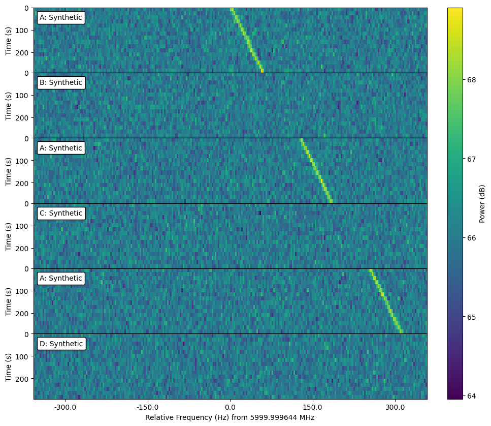
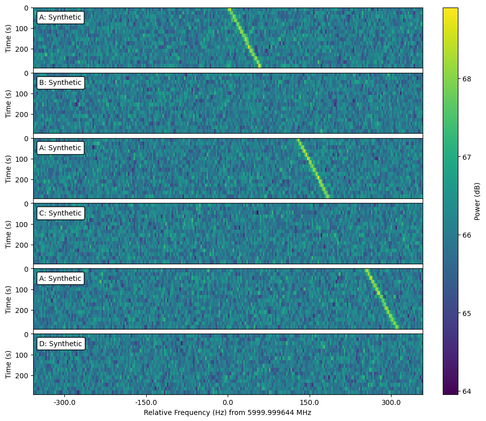

.. |setigen| replace:: :mod:`setigen`
.. _setigen.funcs: https://setigen.readthedocs.io/en/main/setigen.funcs.html
.. _`Getting started`: https://setigen.readthedocs.io/en/main/getting_started.html
.. _`observational data`: https://setigen.readthedocs.io/en/main/advanced.html#creating-custom-observational-noise-distributions

Cadences
========

Radio SETI observations are often taken as part of a cadence, with repeated 
observations in a target direction. The order of observations is often 
described using a sequence of letters, like "ABACAD" or "ABABAB", to indicate 
which pointings are unique.

|setigen| provides the Cadence object to organize multiple frames. This allows 
you to inject signals into multiple frames in one step, for example.

You can either create an empty Cadence and add frames to it later or 
initialize the object with a list of frames:

.. code-block:: Python

    c = stg.Cadence()
    c.append(stg.Frame(...))
    c.append(stg.Frame(...))

    c = stg.Cadence(frame_list=[stg.Frame(...), stg.Frame(...)])

The Cadence object doesn't have an imposed order; it serves as a bare-bones 
organizational structure for frames. If you would like to impose an order,
use the OrderedCadence:

.. code-block:: Python

    c = stg.OrderedCadence(frame_list, 
                           order="ABACAD")
                        
The OrderedCadence adds an :code:`order_label` field to each frame's metadata, 
tracking the unique pointings. 

Cadence objects supports Python list operations, such as append and slicing. In
addition, OrderedCadences can be filtered by order labels with 
:func:`~setigen.cadence.OrderedCadence.by_label`, which returns the appropriate 
frames as a new Cadence object. 

You can execute functions on each frame in a cadence using 
:func:`~setigen.cadence.Cadence.apply`. This can be used, for example, to add 
noise to each frame:

.. code-block:: Python

    c.apply(lambda fr: fr.add_noise(4e6))

For convenience, cadences also have :func:`~setigen.cadence.Cadence.add_signal`,
which passes all arguments through to :func:`setigen.Frame.add_signal`, but 
adjusts the times used in the signal calculation appropriately. 

As an example, if you wanted to add a drifting signal only to "A" observations:

.. code-block:: Python

    c.by_label("A").add_signal(stg.constant_path(f_start=c[0].get_frequency(index=128),
                                   drift_rate=0.2*u.Hz/u.s),
                               stg.constant_t_profile(level=c[0].get_intensity(snr=30)),
                               stg.sinc2_f_profile(width=2*c[0].df*u.Hz),
                               stg.constant_bp_profile(level=1),
                               doppler_smearing=True)
    fig = plt.figure(figsize=(10, 10))
    c.plot()

Cadence plotting has similar arguments to frame plotting, but you can also 
have the subplots spaced out vertically in proportion to the slew time in 
between observations by setting :code:`slew_times=True`.

.. code-block:: Python

    fig = plt.figure(figsize=(10, 10))
    c.plot(slew_times=True)

These examples are using fully synthetic frames, but the cadence frames can 
just as easily use observational data, as long as the resolutions and frequency 
extent match.