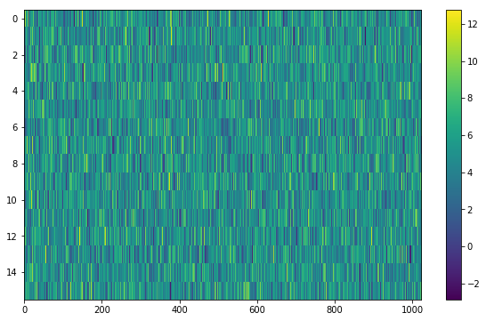
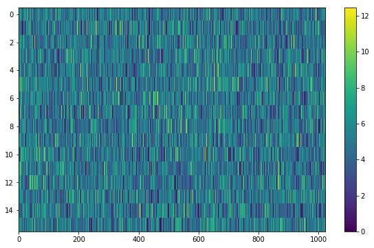
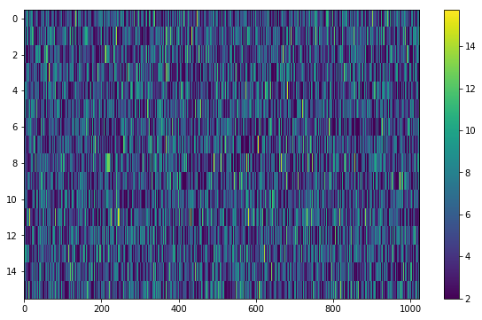

Adding synthetic noise
======================

Adding pure Gaussian noise
--------------------------

Currently, all the synthetic noise routines packaged with :mod:`setigen` are based on Gaussian noise. 

Every time synthetic noise is added to an image, :mod:`setigen` will try to estimate the noise properties of the frame, and you can get these via :func:`~setigen.Frame.get_total_stats` and :func:`~setigen.Frame.get_noise_stats`.

A minimal working example for adding noise is:

.. code-block:: python

    import matplotlib.pyplot as plt
    import numpy as np
    from astropy import units as u
    import setigen as stg

    # Define time and frequency arrays, essentially labels for the 2D data array
    fchans = 1024
    tchans = 16
    df = -2.7939677238464355*u.Hz
    dt = 18.25361108*u.s
    fch1 = 6095.214842353016*u.MHz
    
    # Generate the signal
    frame = stg.Frame(fchans, tchans, df, dt, fch1)
    noise = frame.add_noise(x_mean=5, x_std=2)
    
    fig = plt.figure(figsize=(10,6))
    plt.imshow(frame.get_data(), aspect='auto')
    plt.colorbar()
    plt.show()
    

    
This adds Gaussian noise with mean 5 and standard deviation 2 to an empty frame. In addition, we can truncate the noise at a lower bound specified by parameter `x_min`:

.. code-block:: python

    noise = frame.add_noise(x_mean=5, x_std=2, x_min=0)
    

This may be useful depending on the use case; you might not want negative intensities, or simply any intensity below a reasonable threshold, to occur in your synthetic data.

Adding Gaussian noise based on real observations
------------------------------------------------

We can also generate synthetic noise whose parameters are sampled from real observations. Specifically, we can select the mean, standard deviation, and minimum from distributions of parameters estimated from observations. 

If no distributions are specified explicitly, noise parameters are sampled by default from pre-loaded distributions in :mod:`setigen`. These were estimated from GBT C-Band observations on frames with (dt, df) = (1.4 s, 1.4 Hz) and (tchans, fchans) = (32, 1024). Note that these pre-loaded observations only serve as approximations and real observation vary depending on the noise temperature + frequency band. To be safe, generate your own parameters distributions from observational data! A suite for facilitating this will be coming to :mod:`setigen` soon.

Without specifying distributions:

.. code-block:: python

    noise = frame.add_noise_from_obs()
    
.. image:: noise_from_obs_default.png

We can readily see that the intensities are similar to a real GBT observation.

We can also specify the distributions from which to sample parameters, one each for the mean, standard deviation, and minimum, as below. Note: just as in the pure noise generation above, you don't need to specify an x_min_array from which to sample if there's no need to truncate the noise at a lower bound.

.. code-block:: python

    noise = frame.add_noise_from_obs(x_mean_array=[3,4,5],
                                     x_std_array=[1,2,3],
                                     x_min_array=[1,2])
    

