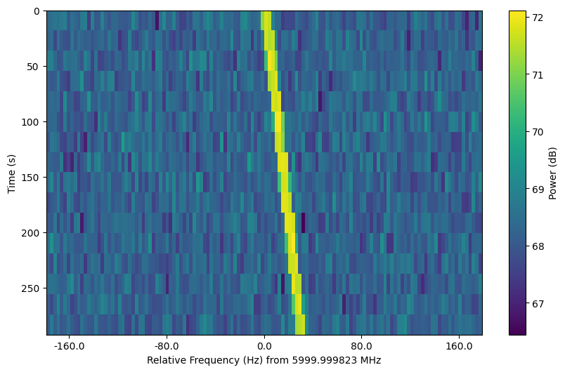
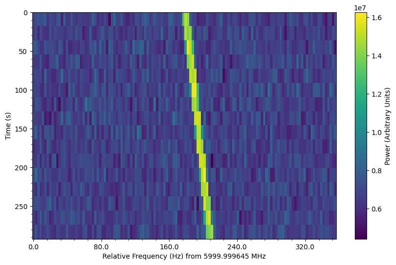
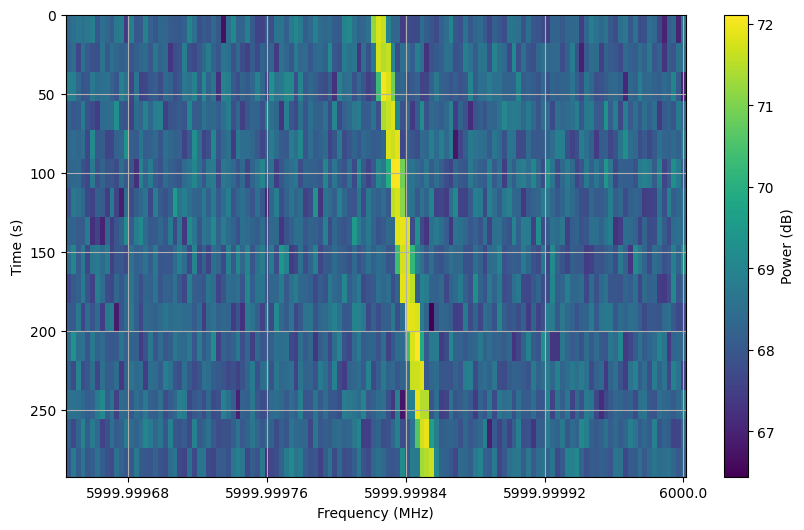
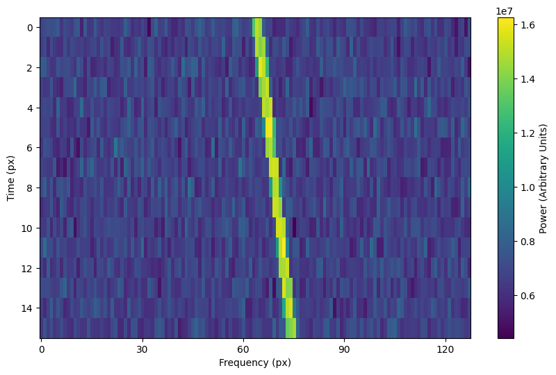
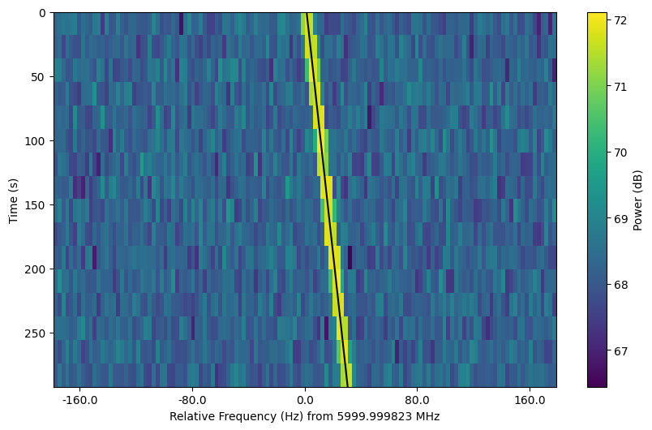

.. |setigen| replace:: :mod:`setigen`
.. _setigen.funcs: https://setigen.readthedocs.io/en/main/setigen.funcs.html
.. _`Getting started`: https://setigen.readthedocs.io/en/main/getting_started.html
.. _`observational data`: https://setigen.readthedocs.io/en/main/advanced.html#creating-custom-observational-noise-distributions

Frame methods
=============

Getting frame data
------------------

To just grab the underlying intensity data, you can do

.. code-block:: Python

    data = frame.get_data(db=False)

As it implies, if you set the :code:`db` flag to True, it will express
the intensities in terms of decibels. This can help visualize data a little better,
depending on the application.

Plotting frames
---------------

There are a variety of options for plotting frames, meant to produce 
publication-ready images. The main function is :func:`~setigen.frame.Frame.plot`.

You may choose what style of axes ticks and labels to use with the parameter 
:code:`xtype`. By default, :code:`xtype=fmid` expresses the `x`-axis as the 
relative offset from the central frequency.

.. code-block:: Python

    fr.plot()

:code:`xtype=fmid` expresses the `x`-axis as the relative offset from the 
minimum frequency. In addition, we can disable the dB scaling of the 
colorbar and turn on minor ticks:

.. code-block:: Python

    fr.plot(xtype="fmin", db=False, minor_ticks=True)

:code:`xtype=f` expresses the `x`-axis as absolute frequencies in MHz. 
In addition, we can turn on a grid:

.. code-block:: Python

    fr.plot(xtype="f", grid=True)

Finally, :code:`xtype=px` expresses both axes in terms of pixels.

.. code-block:: Python

    fr.plot(xtype="fmin", db=False)

Note that these plots are created using the corresponding units, so that you can 
actually plot over them in an intuitive way. For example, we can overplot a 
line following the path of our synthetic signals (frame attribute :code:`ts_ext` 
is a time array of length :code:`tchans + 1` that includes the end of the frame):

.. code-block:: Python

    fr.plot(xtype="fmid", db=True)
    plt.plot(fr.ts_ext * drift_rate + fr.get_frequency(index=fr.fchans//2) - fr.fmid, 
             fr.ts_ext,
             c='k')

The plotting function uses :code:`matplotlib.pyplot.imshow` behind
the scenes, which means you can still control plot parameters before and after
these function calls, e.g.

.. code-block:: Python

    fig = plt.figure(figsize=(10, 6))
    frame.plot()
    plt.title('My awesome title')
    plt.savefig('frame.png')
    plt.show()
    
Frame integration
-----------------

To time integrate to get a spectrum, or to frequency integrate to get time series 
intensities, you can use :func:`~setigen.frame.Frame.integrate`:

.. code-block:: Python
    
    spectrum = frame.integrate() # stg.integrate(frame)
    time_series = frame.integrate(axis='f') # or axis=1
    
This function is a wrapper for :func:`~setigen.integrate`, with the same parameters. The
:code:`axis` parameter can be either 't' or 0 to integrate along the time axis, or 'f' or 
1 to integrate along the frequency axis. The :code:`mode` parameter can be either 'mean' or
'sum' to determine the manner of integration.

Frame slicing
-------------

Given frequency boundary indices :code:`l` and :code:`r`, we can "slice" a frame by using 
:func:`~setigen.frame.Frame.get_slice`, a wrapper for :func:`~setigen.get_slice`:

.. code-block:: Python

    s_fr = frame.get_slice(l, r) # stg.get_slice(frame, l, r)
    
Slicing is analogous to Numpy slicing, e.g. :code:`A[l:r]`, along the frequency axis.
This method returns a new frame with only the sliced data. This is useful when chained
together with boundary detection methods, or simply to isolate sections of a frame
for analysis.

Doppler dedrifting
------------------

If you have a frame containing a Doppler drifting signal, you can "dedrift" the frame
using :func:`setigen.dedrift`, specifying a target drift rate (Hz/s):

.. code-block:: Python

    dd_fr = stg.dedrift(frame, drift_rate=2)
    
This returns a new frame with only the dedrifted data; this will be smaller in
the frequency dimension depending on the drift rate and frame resolution. 

Alternatively, if 'drift_rate' is contained in the frame's metadata 
(:code:`frame.metadata`), the function will automatically dedrift the frame using that 
value. 

.. code-block:: Python

    drift_rate = 2
    frame.metadata['drift_rate'] = drift_rate
    dd_fr = stg.dedrift(frame)