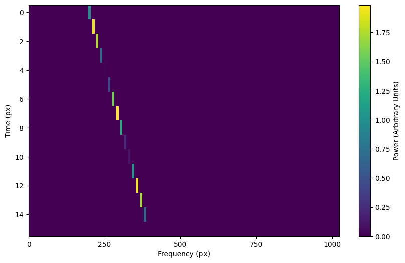
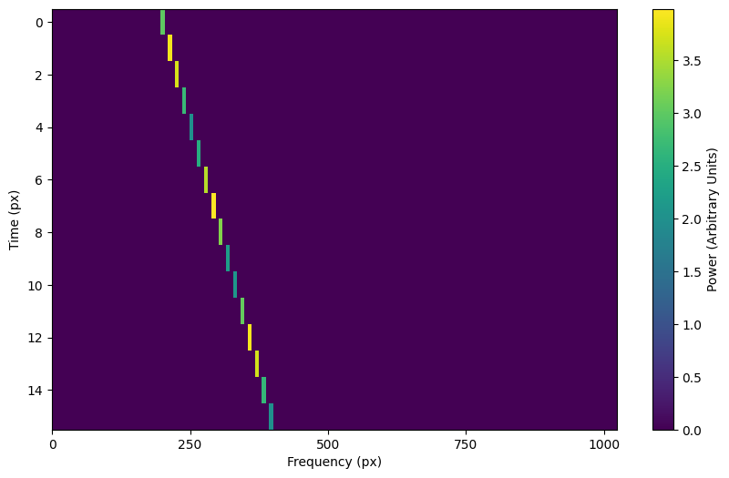
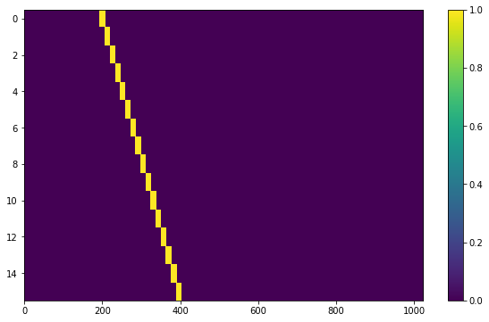
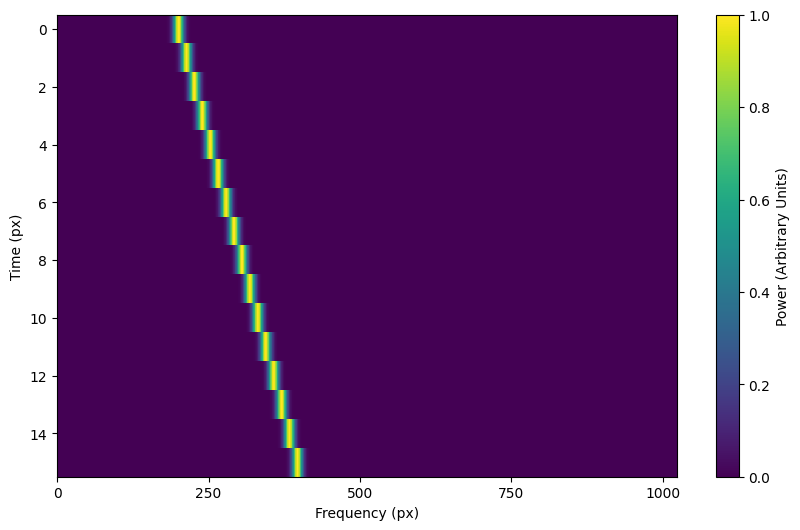
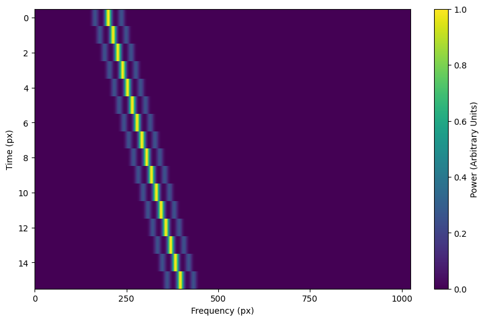

.. _setigen.funcs: https://setigen.readthedocs.io/en/master/setigen.funcs.html

Generating synthetic signals
============================

Adding a basic signal
-------------------------

The main method that generates signals is :func:`setigen.Frame.add_signal`.
This allows us to pass in an functions or arrays that describe
the shape of the signal over time, over frequency within individual time samples,
and over a bandpass of frequencies. :mod:`setigen` comes prepackaged with common
functions (setigen.funcs_), but you can write your own!

The most basic signal that you can generate is a constant intensity, constant
drift-rate signal.

.. code-block:: python

    from astropy import units as u
    import numpy as np

    import setigen as stg

    # Define time and frequency arrays, essentially labels for the 2D data array
    fchans = 1024
    tchans = 16
    df = 2.7939677238464355*u.Hz
    dt = 18.25361108*u.s
    fch1 = 6095.214842353016*u.MHz

    # Generate the signal
    frame = stg.Frame(fchans=fchans, 
                      tchans=tchans, 
                      df=df, 
                      dt=dt, 
                      fch1=fch1)
    signal = frame.add_signal(stg.constant_path(f_start=frame.get_frequency(200),
                                                drift_rate=2*u.Hz/u.s),
                              stg.constant_t_profile(level=1),
                              stg.box_f_profile(width=20*u.Hz),
                              stg.constant_bp_profile(level=1))

:code:`signal` is a 2D NumPy array with the resulting time-frequency data. To
visualize this, we use :func:`matplotlib.pyplot.imshow`::

    import matplotlib.pyplot as plt
    fig = plt.figure(figsize=(10, 6))
    plt.imshow(frame.get_data(), aspect='auto')
    plt.colorbar()
    fig.savefig("basic_signal.png", bbox_inches='tight')

Using prepackaged signal functions
----------------------------------

With :mod:`setigen`'s pre-written signal functions, you can generate a variety
of signals right off the bat. The main signal parameters that customize the
synthetic signal are :code:`path`, :code:`t_profile`, :code:`f_profile`, and
:code:`bp_profile`.

:code:`path` describes the path of the signal in time-frequency space. The
:code:`path` function takes in a time and outputs 'central' frequency
corresponding to that time.

:code:`t_profile` (time profile) describes the intensity of the signal over
time. The :code:`t_profile` function takes in a time and outputs an intensity.

:code:`f_profile` (frequency profile) describes the intensity of the signal
within a time sample as a function of relative frequency. The :code:`f_profile`
function takes in a frequency and a central frequency and computes an intensity.
This function is used to control the spectral shape of the signal (with respect
to a central frequency), which may be a square wave, a Gaussian, or any custom
shape!

:code:`bp_profile` describes the intensity of the signal over the bandpass of
frequencies. Whereas :code:`f_profile` computes intensity with respect to a
relative frequency, :code:`bp_profile` computes intensity with respect to the
absolute frequency value. The :code:`bp_profile` function takes in a frequency
and outputs an intensity as well.

All these functions combine to form the final synthetic signal, which means
you can create a host of signals by switching up these parameters!

Here are just a few examples of pre-written signal functions. To see all of the included functions, check out setigen.funcs_. To avoid needless
repetition, each example script will assume the same basic setup:

.. code-block:: python

    from astropy import units as u
    import numpy as np

    import setigen as stg

    # Define time and frequency arrays, essentially labels for the 2D data array
    fchans = 1024
    tchans = 16
    df = 2.7939677238464355*u.Hz
    dt = 18.25361108*u.s
    fch1 = 6095.214842353016*u.MHz

    # Generate the signal
    frame = stg.Frame(fchans=fchans, 
                      tchans=tchans, 
                      df=df, 
                      dt=dt, 
                      fch1=fch1)

:code:`paths` - trajectories in time-frequency space
^^^^^^^^^^^^^^^^^^^^^^^^^^^^^^^^^^^^^^^^^^^^^^^^^^^^

Constant path
~~~~~~~~~~~~~

A constant path is a linear Doppler-drifted signal. To generate this path, use
:func:`~setigen.funcs.paths.constant_path` and specify the starting frequency of
the signal and the drift rate (in units of frequency over time, consistent with
the units of your time and frequency arrays):

.. code-block:: python

    signal = frame.add_signal(stg.constant_path(f_start=frame.get_frequency(200),
                                                drift_rate=2*u.Hz/u.s),
                              stg.constant_t_profile(level=1),
                              stg.box_f_profile(width=20*u.Hz),
                              stg.constant_bp_profile(level=1))

Sine path
~~~~~~~~~

This path is a sine wave, controlled by a starting frequency, drift rate, period,
and amplitude, using :func:`~setigen.funcs.paths.sine_path`.

.. code-block:: python

    signal = frame.add_signal(stg.sine_path(f_start=frame.get_frequency(200),
                                            drift_rate=2*u.Hz/u.s,
                                            period=100*u.s,
                                            amplitude=100*u.Hz),
                              stg.constant_t_profile(level=1),
                              stg.box_f_profile(width=20*u.Hz),
                              stg.constant_bp_profile(level=1))

Squared path
~~~~~~~~~~~~

This path is a very simple quadratic with respect to time, using
:func:`~setigen.funcs.paths.squared_path`.

.. code-block:: python

    signal = frame.add_signal(stg.squared_path(f_start=frame.get_frequency(200),
                                               drift_rate=0.01*u.Hz/u.s),
                              stg.constant_t_profile(level=1),
                              stg.box_f_profile(width=20*u.Hz),
                              stg.constant_bp_profile(level=1))

:code:`t_profiles`
^^^^^^^^^^^^^^^^^^

Constant intensity
~~~~~~~~~~~~~~~~~~

To generate a signal with the same intensity over time, use
:func:`~setigen.funcs.t_profiles.constant_t_profile`, specifying only the
intensity level:

.. code-block:: python

    signal = frame.add_signal(stg.constant_path(f_start=frame.get_frequency(200),
                                            drift_rate=2*u.Hz/u.s),
                          stg.constant_t_profile(level=1),
                          stg.box_f_profile(width=20*u.Hz),
                          stg.constant_bp_profile(level=1))

Sine intensity
~~~~~~~~~~~~~~

To generate a signal with sinuisoidal intensity over time, use
:func:`~setigen.funcs.t_profiles.sine_t_profile`, specifying the period,
amplitude, and average intensity level. The intensity level is essentially an
offset added to a sine function, so it should be equal or greater than the
amplitude so that the signal doesn't have any negative values.

Here's an example with equal level and amplitude:

.. code-block:: python

    signal = frame.add_signal(stg.constant_path(f_start=frame.get_frequency(200),
                                                drift_rate=2*u.Hz/u.s),
                              stg.sine_t_profile(period=100*u.s,
                                                 amplitude=1,
                                                 level=1),
                              stg.box_f_profile(width=20*u.Hz),
                              stg.constant_bp_profile(level=1))

And here's an example with the level a bit higher than the amplitude:

.. code-block:: python

    signal = frame.add_signal(stg.constant_path(f_start=frame.get_frequency(200),
                                                drift_rate=2*u.Hz/u.s),
                              stg.sine_t_profile(period=100*u.s,
                                                 amplitude=1,
                                                 level=3),
                              stg.box_f_profile(width=20*u.Hz),
                              stg.constant_bp_profile(level=1))

:code:`f_profiles`
^^^^^^^^^^^^^^^^^^

Box / square intensity profile
~~~~~~~~~~~~~~~~~~~~~~~~~~~~~~

To generate a signal with the same intensity over frequency, use
:func:`~setigen.funcs.f_profiles.box_f_profile`, specifying the width of the
signal:

.. code-block:: python

    signal = frame.add_signal(stg.constant_path(f_start=frame.get_frequency(200),
                                                drift_rate=2*u.Hz/u.s),
                              stg.constant_t_profile(level=1),
                              stg.box_f_profile(width=40*u.Hz),
                              stg.constant_bp_profile(level=1))

Gaussian intensity profile
~~~~~~~~~~~~~~~~~~~~~~~~~~

To generate a signal with a Gaussian intensity profile in the frequency
direction, use :func:`~setigen.funcs.f_profiles.gaussian_f_profile`, specifying
the width of the signal:

.. code-block:: python

    signal = frame.add_signal(stg.constant_path(f_start=frame.get_frequency(200),
                                                drift_rate=2*u.Hz/u.s),
                              stg.constant_t_profile(level=1),
                              stg.gaussian_f_profile(width=40*u.Hz),
                              stg.constant_bp_profile(level=1))

Multiple Gaussian intensity profile
~~~~~~~~~~~~~~~~~~~~~~~~~~~~~~~~~~~

The profile :func:`~setigen.funcs.f_profiles.multiple_gaussian_f_profile`,
generates a symmetric signal with three Gaussians; one main signal and two
smaller signals on either side.

.. code-block:: python

    signal = frame.add_signal(stg.constant_path(f_start=frame.get_frequency(200),
                                                drift_rate=2*u.Hz/u.s),
                              stg.constant_t_profile(level=1),
                              stg.multiple_gaussian_f_profile(width=40*u.Hz),
                              stg.constant_bp_profile(level=1))

Writing custom signal functions
-------------------------------

You can easily go beyond :mod:`setigen`'s pre-written signal functions by
writing your own. For each :func:`~setigen.generate_signal.generate` parameter
(:code:`path`, :code:`t_profile`, :code:`f_profile`, and :code:`bp_profile`),
you can pass in your own custom functions.

For example, here's the code behind the sine path shape:

.. code-block:: python

    def sine_path(f_start, drift_rate, period, amplitude):
        def path(t):
            return f_start + amplitude * np.sin(2 * np.pi * t / period) + drift_rate * t
        return path

Alternately, you can use the lambda operator:

.. code-block:: python

    def sine_path(f_start, drift_rate, period, amplitude):
        return lambda t: return f_start + amplitude * np.sin(2 * np.pi * t / period) + drift_rate * t

It's important that the function you pass into each parameter has the correct
input and output. Specifically:

    :code:`path`
        Takes in time ``t`` and outputs a frequency

    :code:`t_profile`
        Takes in time ``t`` and outputs an intensity

    :code:`f_profile`
        Takes in frequency ``f`` and a reference central frequency ``f_center``,
        and outputs an intensity

    :code:`bp_profile`
        Takes in frequency ``f`` and outputs an intensity

To generate synthetic signals, :func:`~setigen.generate_signal.generate` uses
these functions to compute intensity for each time, frequency pair in the data.

To see more examples on how to write your own parameter functions, check out the
source code behind the pre-written functions (:mod:`setigen.funcs`).
