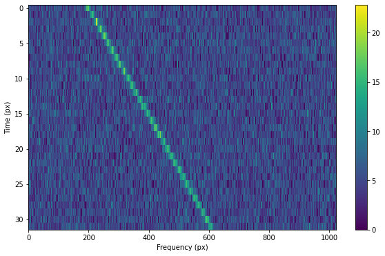
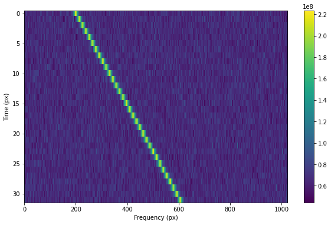
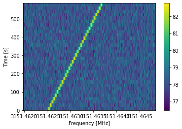

.. |setigen| replace:: :mod:`setigen`

Getting started
===============

The heart of |setigen| is the Frame object. For signal injection and manipulation, we call each snippet of time-frequency data a "frame." There are two main ways to initialize frames, starting from either resolution/size parameters or existing observational data.

Here's a minimal working example for a purely synthetic frame, injecting a constant intensity signal into a background of Gaussian noise. Parameters in |setigen| are specified either in terms of SI units (Hz, s) or `astropy.units`, as in the example:

.. code-block:: python

    from astropy import units as u
    import setigen as stg
    import matplotlib.pyplot as plt

    frame = stg.Frame(fchans=1024*u.pixel,
                      tchans=32*u.pixel,
                      df=2.7939677238464355*u.Hz,
                      dt=18.25361108*u.s,
                      fch1=6095.214842353016*u.MHz)
    frame.add_noise(x_mean=5, x_std=2, x_min=0)
    frame.add_signal(stg.constant_path(f_start=frame.get_frequency(200),
                                       drift_rate=2*u.Hz/u.s),
                     stg.constant_t_profile(level=frame.get_intensity(snr=30)),
                     stg.gaussian_f_profile(width=40*u.Hz),
                     stg.constant_bp_profile(level=1))
                  
    fig = plt.figure(figsize=(10, 6))
    frame.render()
    plt.savefig('frame.png', bbox_inches='tight')
    plt.show()
    

This simple signal can also be generated using the method `frame.add_constant_signal`, which is optimized for created signals of constant intensity and drift rate in large frames:

.. code-block:: python

    frame.add_constant_signal(f_start=frame.get_frequency(200),
                              drift_rate=2*u.Hz/u.s,
                              level=frame.get_intensity(snr=30),
                              width=40*u.Hz,
                              f_profile_type='gaussian')
    
Similarly, here's a minimal working example for injecting a signal into a frame of observational data (from a blimpy Waterfall object). Note that in this example, the observational data also has dimensions 32x1024 to make it easy to visualize here.

.. code-block:: python

    from astropy import units as u
    import setigen as stg
    import blimpy as bl
    import matplotlib.pyplot as plt

    data_path = 'path/to/data.fil'
    fil = bl.Waterfall(data_path)
    frame = stg.Frame(fil=fil)
    frame.add_signal(stg.constant_path(f_start=frame.get_frequency(200),
                                       drift_rate=2*u.Hz/u.s),
                     stg.constant_t_profile(level=frame.get_intensity(snr=30)),
                     stg.gaussian_f_profile(width=40*u.Hz),
                     stg.constant_bp_profile(level=1))
                     
    fig = plt.figure(figsize=(10, 6))
    frame.render()
    plt.show()
    

We can also view this using blimpy's plotting style:

.. code-block:: python

    fig = plt.figure(figsize=(10, 6))
    frame.bl_render()
    plt.show()
    
