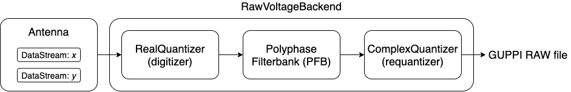

.. |setigen| replace:: :mod:`setigen`
.. _setigen.voltage: https://setigen.readthedocs.io/en/main/setigen.voltage.html

Voltage synthesis (setigen.voltage)
===================================

The setigen.voltage_ module extends |setigen| to the voltage regime. Instead of 
directly synthesizing spectrogram data, we can produce real voltages, pass them 
through a software pipeline based on a polyphase filterbank, and record to file 
in GUPPI RAW format. As this process models actual hardware used by 
Breakthrough Listen for recording raw voltages, this enables lower level 
testing and experimentation.

A set of tutorial walkthroughs can be found `here <https://github.com/bbrzycki/setigen/tree/main/jupyter-notebooks/voltage>`_.

The basic pipeline structure
----------------------------

The basic layout of a voltage pipeline written using :code:`setigen.voltage` 
is shown in the image. 

First, we have an Antenna, which contains DataStreams for each polarization 
(1 or 2 total). Noise and signals are added to individual DataStreams, so 
that polarizations are unique and not necessarily correlated. These are added 
as functions, which accept an array of times in seconds and return an array 
of voltages, corresponding to random noise or defined signals. This allows us 
to obtain voltage samples on demand from each DataStream, and by extension 
from the Antenna. 

The main backend elements are the digitizer, filterbank, and requantizer. 
The digitizer quantizes input voltages to a desired number of bits, and a 
desired full width at half maximum (FWHM) in the quantized voltage space. 
The filterbank implements a software polyphase filterbank, coarsely 
channelizing input voltages. The requantizer takes the resulting complex 
voltages, and quantizes each component to either 8 or 4 bits, suitable for 
saving into GUPPI RAW format. 

All of these elements are wrapped into the RawVoltageBackend, which connects 
each piece together. The main method 
:func:`~setigen.voltage.backend.RawVoltageBackend.record` automatically 
retrieves real voltages as needed and passes them through each backend element, 
finally saving out the quantized complex voltages to disk.

A minimal working example of the pipeline is as follows:

.. code-block:: python

    from astropy import units as u
    import setigen as stg

    antenna = stg.voltage.Antenna(sample_rate=3e9*u.Hz, 
                                  fch1=6000e6*u.Hz,
                                  ascending=True,
                                  num_pols=1)
                                  
    antenna.x.add_noise(v_mean=0, 
                        v_std=1)
                        
    antenna.x.add_constant_signal(f_start=6002.2e6*u.Hz, 
                                  drift_rate=-2*u.Hz/u.s, 
                                  level=0.002)
                                  
    digitizer = stg.voltage.RealQuantizer(target_fwhm=32,
                                          num_bits=8)

    filterbank = stg.voltage.PolyphaseFilterbank(num_taps=8, 
                                                 num_branches=1024)

    requantizer = stg.voltage.ComplexQuantizer(target_fwhm=32,
                                               num_bits=8)

    rvb = stg.voltage.RawVoltageBackend(antenna,
                                        digitizer=digitizer,
                                        filterbank=filterbank,
                                        requantizer=requantizer,
                                        start_chan=0,
                                        num_chans=64,
                                        block_size=134217728,
                                        blocks_per_file=128,
                                        num_subblocks=32)
                                        
    rvb.record(output_file_stem='example_1block',
               num_blocks=1, 
               length_mode='num_blocks',
               header_dict={'HELLO': 'test_value',
                            'TELESCOP': 'GBT'},
               load_template=True,
               verbose=True)
               
Note the :code:`load_template` argument, which loads keys from the internal 
`header_template.txt <https://github.com/bbrzycki/setigen/blob/main/setigen/voltage/header_template.txt>`_.

Using GPU acceleration
----------------------

The process of synthesizing real voltages at a high sample rate and passing 
through multiple signal processing steps can be very computationally expensive 
on a CPU. Accordingly, if you have access to a GPU, it is highly recommended 
to install CuPy, which performs the equivalent NumPy array operations on the 
GPU (https://docs.cupy.dev/en/stable/install.html). This is not necessary to 
run raw voltage generation, but will highly accelerate the pipeline. 

Once you have CuPy installed, to enable GPU acceleration, you must set 
:code:`SETIGEN_ENABLE_GPU` to '1' in the shell or in Python via 
:code:`os.environ`. It can also be useful to set :code:`CUDA_VISIBLE_DEVICES` 
to specify which GPUs to use. The following enables GPU usage and specifies to 
use the GPU indexed as 0.

In Bash:

.. code-block:: bash

    export SETIGEN_ENABLE_GPU=1
    export CUDA_VISIBLE_DEVICES=0
    
In Python:

.. code-block:: python

    import os
    os.environ['SETIGEN_ENABLE_GPU'] = '1'
    os.environ['CUDA_VISIBLE_DEVICES'] = '0'
    
Details behind classes
----------------------

Adding noise and signal sources
^^^^^^^^^^^^^^^^^^^^^^^^^^^^^^^

If your application uses two polarizations, an Antenna's data streams are 
available via the :code:`Antenna.x` and :code:`Antenna.y` attributes. For one 
polarization, only the former is available. We can inject noise and signal 
sources to these individual data streams. Note that you can still add signal 
sources after the RawVoltageBackend is created; real voltages are only 
computed at execution time.

Real voltage noise is modeled as ideal Gaussian noise. Note that this actually 
stores a function with the DataStream that isn't evaluated until 
:func:`~setigen.voltage.data_stream.DataStream.get_samples` is actually called:

.. code-block:: python

    antenna.x.add_noise(v_mean=0, 
                        v_std=1)

For convenience, the :code:`Antenna.streams` attribute is a list containing 
the available data streams for each polarization. So, to add a Gaussian noise 
source (with the same statistics) to each antenna, you can do:

.. code-block:: python

    for stream in antenna.streams:
        stream.add_noise(v_mean=0, 
                         v_std=1)
                         
This will adjust the :code:`DataStream.noise_std` parameter for each 
polarization, which is also accessible using 
:func:`~setigen.voltage.data_stream.DataStream.get_total_noise_std`. 
                         
We can also add drifting cosine signals to each stream:

.. code-block:: python

    stream.add_constant_signal(f_start=6002.2e6, 
                               drift_rate=-2*u.Hz/u.s, 
                               level=0.002,
                               phase=0)

Here, :code:`f_start` is the starting frequency, :code:`drift_rate` is the 
change in frequency per time in Hz/s, :code:`level` is the amplitude of the 
cosine signal, and :code:`phase` is the phase offset in radians. 
                         
Custom signal sources
^^^^^^^^^^^^^^^^^^^^^

To add custom signal source functions, you can use the :code:`add_signal` 
method:

.. code-block:: python

    stream.add_signal(my_signal_func)
                         
Signal source functions are Python functions that accept an array of times, 
in seconds, and output a corresponding sequence of real voltages. A simple 
example showing how you might generate Gaussian noise "signal":

.. code-block:: python

    def my_noise_source(ts):
        return np.random.normal(0, 1, len(ts))
        
    stream.add_signal(my_noise_source)
                         
As custom signals are added, the :code:`DataStream.noise_std` parameter may no 
longer be accurate. In these cases, you may run 
:func:`~setigen.voltage.data_stream.DataStream.update_noise` to estimate the 
noise based on a few voltages calculated from all noise and signal sources. 
Then, the proper noise standard deviation can be produced via 
:func:`~setigen.voltage.data_stream.DataStream.get_total_noise_std`.

You may also check out these example notebooks: `03_custom_signals.ipynb <https://github.com/bbrzycki/setigen/blob/main/jupyter-notebooks/voltage/03_custom_signals.ipynb>`_ and `04_custom_signals_estimate_noise.ipynb <https://github.com/bbrzycki/setigen/blob/main/jupyter-notebooks/voltage/04_custom_signals_estimate_noise.ipynb>`_.

Quantizers
^^^^^^^^^^

The quantization classes are RealQuantizer and ComplexQuantizer. The latter 
actually uses the former for quantizing real and imaginary components 
independently. Quantization is run per polarization and antenna. 

The quantizers attempt to map the voltage distribution to an ideal quantized 
normal distribution with a target FWHM. Voltages that extend past the range of 
integers representable by :code:`num_bits` are clipped. The standard deviation 
of the voltage distribution is calculated as they are collected, on a subset 
of :code:`stats_calc_num_samples` samples. By default, this calculation is run 
on every pass through the pipeline, but can be limited to periodic calculations 
using the :code:`stats_calc_period` initialization parameter. If this is set to 
anything besides a positive integer, the calculation will only be run on the 
first call and never again (which saves a lot of computation, but may not be 
the most accurate if the voltage distribution changes over time).

Polyphase filterbank
^^^^^^^^^^^^^^^^^^^^

The PolyphaseFilterbank class implements and applies a PFB to quantized input 
voltages. A good introduction to PFBs is Danny C. Price 2016, "Spectrometers 
and Polyphase Filterbanks in Radio Astronomy" 
(http://arxiv.org/abs/1607.03579), as well as the 
`accompanying Jupyter notebook <https://github.com/telegraphic/pfb_introduction/blob/master/pfb_introduction.ipynb>`_. 

The main things to keep in mind when initializing a PolyphaseFilterbank object 
are:

- :code:`num_taps` controls the spectral profile of each individual coarse channel. The larger this is, the closer the spectral response gets to ideal.
- :code:`num_branches` controls the number of coarse channels. After the real FFT, we obtain :code:`num_branches / 2` total coarse channels spanning the Nyquist range.

Voltage backend
^^^^^^^^^^^^^^^

The RawVoltageBackend class connects the various components in the pipeline, 
allowing us to "record" only as much data as we currently need. 

Behind the scenes, the backend actually uses a separate instance of each 
backend element per antenna and polarization. For example, if the backend is 
initialized with a single object instance for each the digitizer, filterbank, 
and requantizer, the backend object will make deep copies for each polarization 
in each antenna. This is done so that quantization (scaling) calculations are 
done independently for separate polarizations and antennas. Alternatively, you 
can initialize the backend with 2D lists of shape (num_antennas, num_pols) for 
each backend element, if, for example, there are variations in the desired 
:code:`target_mean` and :code:`target_fwhm` parameters. 
    
Creating multi-antenna RAW files
--------------------------------

To simulate interferometric pipelines, it may be useful to synthesize raw 
voltage data from multiple antennas. The MultiAntennaArray class supports 
exactly this, creating a list of sub-Antennas each with an associated integer 
delay (in time samples). In addition to the individual data streams that allow 
you to add noise and signals to each Antenna, there are "background" data 
streams :code:`bg_x` and :code:`bg_y` in MultiAntennaArray, representing 
common / correlated noise or RFI that each Antenna can see, subject to the 
(relative) delay. If there are no delays, the background data streams will be 
perfectly correlated for each antenna.

Here's an example initialization for a 3 antenna array:

.. code-block:: python

    sample_rate = 3e9
    delays = np.array([0, 1e-6, 2e-6]) * sample_rate
    maa = stg.voltage.MultiAntennaArray(num_antennas=3,
                                        sample_rate=sample_rate,
                                        fch1=6*u.GHz,
                                        ascending=False,
                                        num_pols=2,
                                        delays=delays)
                                        
You can access both background data streams using the :code:`MultiAntennaArray.bg_streams` attribute:

.. code-block:: python

    for stream in maa.bg_streams:
        stream.add_noise(v_mean=0,
                         v_std=1)
        stream.add_constant_signal(f_start=5998.9e6, 
                                   drift_rate=0*u.Hz/u.s, 
                                   level=0.0025)
                                        
Then, instead of passing a single Antenna into a RawVoltageBackend object, 
you pass in the MultiAntennaArray:

.. code-block:: python

    rvb = stg.voltage.RawVoltageBackend(maa,
                                        digitizer=digitizer,
                                        filterbank=filterbank,
                                        requantizer=requantizer,
                                        start_chan=0,
                                        num_chans=64,
                                        block_size=6291456,
                                        blocks_per_file=128,
                                        num_subblocks=32)
                                        
The RawVoltageBackend will get samples from each Antenna, accounting for the 
background data streams intrinsic to the MultiAntennaArray, subject to each 
Antenna's delays. 

You may also check out this example notebook: `01_multi_antenna_raw_file_gen.ipynb <https://github.com/bbrzycki/setigen/blob/main/jupyter-notebooks/voltage/01_multi_antenna_raw_file_gen.ipynb>`_.

Injecting signals at a desired SNR
----------------------------------

With noise and multiple signal processing operations, including an FFT, it 
can be a bit tricky to choose the correct amplitude of a cosine signal at the 
beginning of the pipeline to achieve a desired signal-to-noise ratio (SNR) in 
the final finely channelized intensity data products. 
:mod:`setigen.voltage.level_utils` has a few helper functions to facilitate 
this, depending on the nature of the desired cosine signal.

Since the final SNR depends on the fine channelization FFT length and the 
time integration factor, as well as parameters inherent to the data production, 
we need external functions to help calculate an amplitude, or level, for our 
cosine signal. 

First off, assume we are creating a non-drifting cosine signal. If the signal 
is at the center of a finely channelized frequency bin, 
:func:`~setigen.voltage.level_utils.get_level` gives the appropriate cosine 
amplitude to achieve a given SNR if the initial real Gaussian noise has a 
variance of 1:

.. code-block:: python

    fftlength = 1024
    num_blocks = 1
    signal_level = stg.voltage.get_level(snr=10, 
                                         raw_voltage_backend=rvb,
                                         fftlength=fftlength,
                                         num_blocks=num_blocks,
                                         length_mode='num_blocks')
                                         
If the noise in the DataStream doesn't have a variance of 1, we need to adjust 
this signal level by multiplying by 
:func:`~setigen.voltage.data_stream.DataStream.get_total_noise_std()`. 
Note that this method also works for data streams within Antennas that are 
part of MultiAntennaArrays, since it will automatically account for the 
background noise in the array. Since the noise power is squared during fine 
channelization, the signal amplitude should go linearly as a function of the 
standard deviation of the noise.

If the signal is non-drifting, in general the spectral response will go as 
:code:`1/sinc^2(x)`, where :code:`x` is the fractional error off of the center 
of the spectral bin. To calculate the corresponding amount to adjust 
signal level, you can use 
:func:`~setigen.voltage.level_utils.get_leakage_factor`. This technically 
calculates :code:`1/sinc(x)`, which is inherently squared naturally along 
with the cosine signal amplitude during fine channelization.

To account for drift rates, it gets a bit more complicated; in general, if the 
drift rate is larger than a pixel by pixel slope of 1 in the final spectrogram 
data products, dividing the initial non-drifting power by that pixel by pixel 
slope will result in the new power. In other words, if `s` is the drift rate 
corresponding to a final pixel by pixel slope of 1, then a signal drifting by 
`2*s` will have half the SNR of the non-drifting signal. For a given 
RawVoltageBackend and reduced data product parameters :code:`fftlength` 
and :code:`int_factor` (integration factor), you can calculate `s` via 
:func:`~setigen.voltage.level_utils.get_unit_drift_rate`. However, the situation 
is much more complicated for drift rates between 0 and `s`, so setigen doesn't 
currently automatically calculate the requisite shift in power. Note that if 
you'd like to adjust the power for drift rates higher than `s`, you should 
adjust the amplitude (level) of the cosine signal by the square root of the 
relevant factor.

An example accounting for multiple effects like these:

.. code-block:: python

    f_start = 6003.1e6
    leakage_factor = stg.voltage.get_leakage_factor(f_start, rvb, fftlength)
    for stream in antenna.streams:
        level = stream.get_total_noise_std() * leakage_factor * signal_level
        stream.add_constant_signal(f_start=f_start, 
                                   drift_rate=0*u.Hz/u.s, 
                                   level=level)

You may also check out this example notebook: `05_raw_file_gen_snr.ipynb <https://github.com/bbrzycki/setigen/blob/main/jupyter-notebooks/voltage/05_raw_file_gen_snr.ipynb>`_.
                                   

Injecting signals starting from existing RAW files
--------------------------------------------------

In addition to recording entirely synthetic voltage data, we can also inject 
signals onto existing RAW files. This approach is somewhat limited, since the 
data in existing RAW files have necessarily already been digitized, 
channelized, and requantized using hardware at the telescope; we cannot add 
the time series real voltage signals. 

Instead, we can use parameters from the RAW data to create synthetic data 
streams, and add the corresponding complex RAW voltages together as our 
"injection". Of course, we want to make sure the synthetic data properties 
match those of the RAW files, so we have a helper function 
:code:`get_raw_params` that returns a dictionary with relevant properties. 
Note that we still need to specify which coarse channel the recorded data 
starts from, since this isn't saved in the header.

.. code-block:: python

    start_chan = 0
    input_file_stem = 'example_snr'

    raw_params = stg.voltage.get_raw_params(input_file_stem=input_file_stem,
                                            start_chan=start_chan)

    antenna = stg.voltage.Antenna(sample_rate=sample_rate,
                                  **raw_params)

To then create a RawVoltageBackend, we use the class method 
:func:`~setigen.voltage.backend.RawVoltageBackend.from_data`, where :code:`input_file_stem` is the 
filename stem as used by :code:`rawspec`. 

.. code-block:: python

    rvb = stg.voltage.RawVoltageBackend.from_data(input_file_stem=input_file_stem,
                                                  antenna_source=antenna,
                                                  digitizer=digitizer,
                                                  filterbank=filterbank,
                                                  start_chan=start_chan,
                                                  num_subblocks=32)

There are a few things to keep in mind here. Since we don't have access to the 
original noise distribution in real voltage space for the recorded RAW data 
(as it was quantized), it may be tough to inject at specific SNR levels. Also, 
if we create an Antenna with only cosine-like signals, the distribution of 
voltages will look highly non-Gaussian. So, if we attempt to digitize or 
requantize this normally, we risk distorting the data and introducing 
artifacts. To avoid this, if the Antenna has no injected Gaussian noise source, 
we can run :func:`~setigen.voltage.backend.RawVoltageBackend.record` with parameter 
:code:`digitize=False`. Then, the signals will be channelized and quantized as 
if they were embedded in zero-mean Gaussian noise with standard deviation 1. 
Now, if there *is* a noise source, you can leave :code:`digitize=True` 
(the default).

.. code-block:: python

    rvb.record(output_file_stem='example_snr_input',
               header_dict={'TELESCOP': 'GBT'},
               digitize=False,
               verbose=True)
               
In the :func:`~setigen.voltage.backend.RawVoltageBackend.record` call, if no 
:code:`num_blocks` or :code:`obs_length` is specified, data will be recorded 
matching the total length / size of the input data. You may specify these 
parameters to record a smaller amount of data (starting from the beginning of 
the input), but of course you can't produce a longer recording than what is 
present in the input. 

Behind the scenes, at each iteration, the backend will read in a full data 
block from disk, and set requantizer statistics (target mean, target standard 
deviation) for each (antenna, polarization) pair for the real and imaginary 
quantizer components. Then, the synthetic data passing through the pipeline is 
requantized to the corresponding standard deviations in each complex component, 
but instead of centering to the target mean, they are centered to zero mean. 
This is so that when we add the synthetic data to the existing data, we don't 
change the overall voltage means. After these are added together, we finally 
requantize once more with the same requantizers, to the target mean and 
standard deviations. This procedure is done to match the existing data 
statistics and magnitudes as best as possible.

You may also check out this example notebook: `06_starting_from_existing_raw_files.ipynb <https://github.com/bbrzycki/setigen/blob/main/jupyter-notebooks/voltage/06_starting_from_existing_raw_files.ipynb>`_.